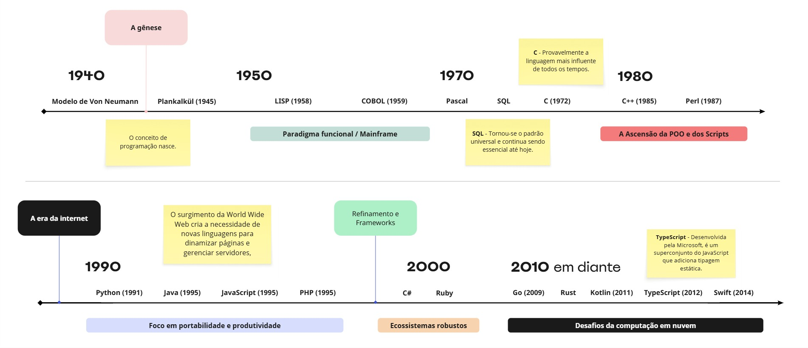

# Desafio 01 - Introdução as Linguagens de Programação
Este desafio tem como proposta pesquisar e **montar uma linha do tempo** da evolução das linguagens, destacando marcos que eu considerar mais relevantes.

## 1. Linha do tempo (Timeline)
A evolução das linguagens de programação tem sido um campo dinâmico, marcado pela  introdução de novos paradigmas, aprimoramentos em características fundamentais e a resposta às crescentes demandas da computação. 

> 

## 2. Breve detalhamento de cada intervalo de tempo
### Década de 1940: A Gênese

O conceito de programação nasce. As máquinas eram programadas de forma manual e árdua, mas a base teórica para o futuro estava sendo estabelecida.

### Década de 1950: A Primeira Geração

Surgem as primeiras linguagens de programação "de alto nível" realmente utilizáveis, mudando a programação de uma tarefa de engenharia elétrica para uma disciplina de lógica e matemática.

### Década de 1960: Diversificação e Novos Paradigmas

A programação se torna mais acessível e as sementes da programação orientada a objetos são plantadas. 

Ex: BASIC (1964) e SIMULA 67 (1967)

### Década de 1970: Estrutura e Sistemas

O foco se volta para a criação de software mais robusto e de fácil manutenção, com linguagens que se tornariam pilares da indústria.

### Década de 1980: A Ascensão da POO e dos Scripts

A programação orientada a objetos explode em popularidade, enquanto as linguagens de script começam a automatizar tarefas.

### Década de 1990: A Era da Internet

O surgimento da World Wide Web cria a necessidade de novas linguagens para dinamizar páginas e gerenciar servidores, com foco em portabilidade e produtividade.

### Década de 2000: Refinamento e Frameworks

As linguagens se consolidam em ecossistemas robustos, com frameworks que aceleram drasticamente o desenvolvimento.

### Década de 2010 em diante: Segurança, Concorrência e Pragmatismo

Uma nova onda de linguagens surge para resolver os desafios da computação em nuvem, sistemas massivamente concorrentes e segurança de memória.

